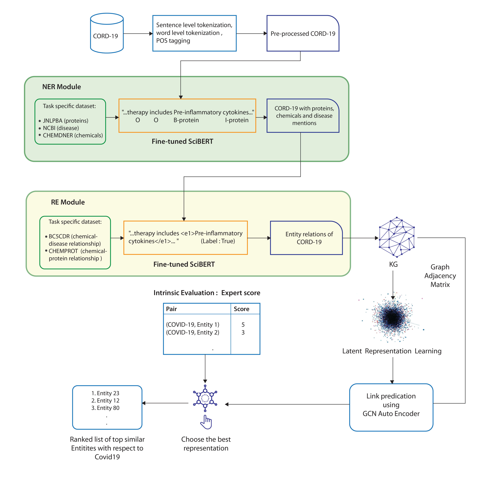

# ERLKG: Entity Representation Learning and Knowledge Graph based association analysis of COVID-19 through mining of unstructured biomedical corpora
# Abstract
We introduce a generic, human-out-of-theloop pipeline, ERLKG, to perform rapid association analysis of any biomedical entity with other existing entities from a corpora of
the same domain. Our pipeline consists of a Knowledge Graph (KG) created from the Open Source CORD-19 dataset by fully automating the procedure of information extraction using SciBERT. The best latent entity representations are then found by benchnmarking different KG embedding techniques on the task of link prediction using a Graph Convolution Network Auto Encoder (GCN-AE). We demonstrate the utility of ERLKG with respect to COVID-19 through multiple qualitative evaluations. Due to the lack of a gold standard, we propose a relatively large intrinsic evaluation dataset for COVID-19 and use it for validating the top two performing KG embedding techniques. We find TransD to be the best performing KG embedding technique with Pearson and Spearman correlation scores of 0.4348 and 0.4570 respectively. We demonstrate that a considerable number of ERLKG’s top protein, chemical and disease predictions are currently in consideration for COVID-19 related research.
# Pipeline Architecture

