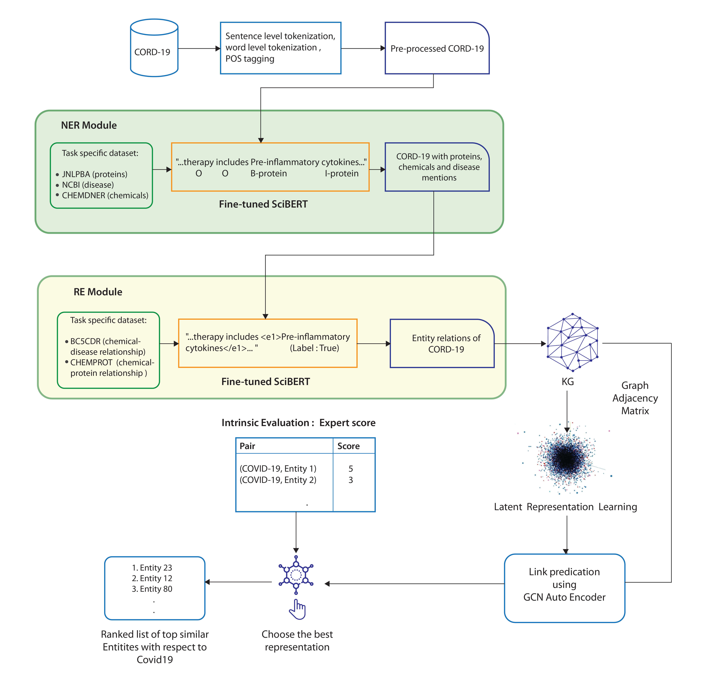

## ERLKG: Entity Representation Learning and Knowledge Graph based association analysis of COVID-19 through mining of unstructured biomedical corpora
#### Authors: [Sayantan Basu](https://www.linkedin.com/in/sayantan-basu-a29861a1/), [Sinchani Chakraborty](https://www.linkedin.com/in/sinchani-chakraborty-087321ab/), [Atif Hassan](https://www.linkedin.com/in/atif-hassan-1a8a45127/), Sana Siddique and [Ashish Anand](https://www.linkedin.com/in/anandashish/)
#### Link
https://www.aclweb.org/anthology/2020.sdp-1.15/

Current status: Accepted, SDP@EMNLP 2020.

[Link to list of accepted papers](https://ornlcda.github.io/SDProc/accepted-papers.html)

Code and corresponding ReadME will be updated soon.

### Abstract
We introduce a generic, human-out-of-the loop pipeline, ERLKG, to perform rapid association analysis of any biomedical entity with other existing entities from a corpora of the same domain. Our pipeline consists of a Knowledge Graph (KG) created from the Open Source CORD-19 dataset by fully automating the procedure of information extraction using SciBERT. The best latent entity representations are then found by benchnmarking different KG embedding techniques on the task of link prediction using a Graph Convolution Network Auto Encoder (GCN-AE). We demonstrate the utility of ERLKG with respect to COVID-19 through multiple qualitative evaluations. Due to the lack of a gold standard, we propose a relatively large intrinsic evaluation dataset for COVID-19 and use it for validating the top two performing KG embedding techniques. We find TransD to be the best performing KG embedding technique with Pearson and Spearman correlation scores of 0.4348 and 0.4570 respectively. We demonstrate that a considerable number of ERLKG’s top protein, chemical and disease predictions are currently in consideration for COVID-19 related research.

### Pipeline Architecture

Illustrator: [Sanket Wakade](https://www.linkedin.com/in/sanket-wakade/)

### Proposed Intrinsic Evaluation Datasets
We have released two datasets for intrinsic evaluation, namely, COV19_729 and COV19_25. The datasets are present in [dataset for intrinsic evaluation](https://github.com/sayantanbasu05/ERKLG/tree/master/Dataset%20for%20Intrinsic%20Evaluation) folder that contain 729 and 25 entities along with their types (chemicals, proteins or diseases). Each entity has a corresponding physician rating (on a scale of 1 to 5) which measures its association with COVID-19.

### Cite
If your work is inspired by our research and/or you use our provided datasets then please cite this paper.

Bib Text: Will be updated upon paper release.
